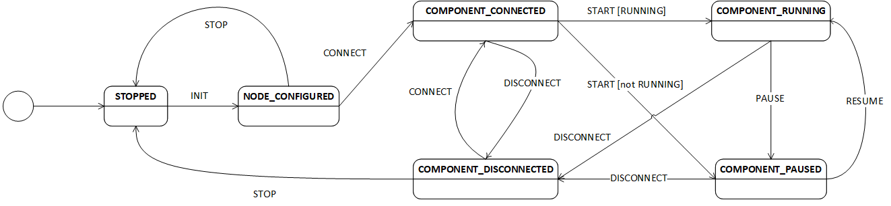

# Abstract node

## How it works and what it is for

To unify the design of ROS nodes (with a special focus on nodes interfacing with hardware devices)
and to allow for state switching and monitoring of all ROS nodes, this base class called `RosenAbstractNode` has been designed.

It provides a state machine along with a ROS action interface to enable (external) state change requests.

This package provides an implementation for C++ and one for Python. To ensure both implementations behave the same way, `rostests` are executed on both implementations.

### State Machine
Each ROS node derived from the abstract node can be in one of the following states:
- stopped (initial state)
- node_configured
- component_connected
- component_running
- component_paused
- component_disconnected

Stopped and node_configured are the only states relevant for the node itself. The others address the state of the device or library used by the node. When a node is launched, its initial state is stopped. The following transitions are possible:



A transition can be initiated by using the provided action `~/state_transition_action` of type [StateTransition.action](./action/StateTransition.action).

The parameter `transition` can be a value definied in [NodeTransition.msg](./msg/NodeTransition.msg). The action provides feedback to the caller with the transition passed and the `current_state` (before the transition) of the node (see [NodeState.msg](./msg/NodeState.msg)). The action can fail with the state `ABORTED` if the transition is not possible. Otherwise it runs until the transition `SUCCEEDED` and provides the `new_state` the node is in afterwards.

### Current state

The current state of each implementation of the abstract node is published with a rate of 1 Hz on topic `~/current_state` ([NodeStateInfo.msg](./msg/NodeStateInfo.msg)).

## Using and deriving from rosen_abstract_node

### Implementing your own node deriving from abstract node

To implement a node, you have to derive from the `RosenAbstractNode` class ([C++](./include/rosen_abstract_node/RosenAbstractNode.h) / [Python](./src/rosen_abstract_node/rosen_abstract_node.py)). The `dummy_node` / `python_dummy_node` represents a (nearly) minimum working example fo this (see [header](./include/rosen_abstract_node/DummyNode.h) and [source](./src/DummyNode.cpp) (C++) or the [Python implementation](./scripts/python_dummy_node.py)) file in this repository).

When implementing, you have to implement the following methods (Python API is similar):

```C++
bool doInit() override;
bool doStop() override;
bool doConnect() override;
bool doDisconnect() override;
bool doPause() override;
bool doStart(bool& running) override;
bool doResume() override;
```

All methods are called by the state machine when doing the according transitions. By setting the boolean return values you can indicate whether the transition was successful or not. The state machine then sets the according states automatically.

The method `doStep()` (shown below) is called on every loop of the state machine. Implement this method to define the behaviour of your node when it is in a particular state - especially when it is in state `running`.

```C++
void doStep() override;
```

### Starting your derived node - the `main`-method

To start your node, you just have to instantiate your node class and call the `loop`-method. See the following `main`-method (C++) as an example:

```C++
int main(int argc, char **argv)
{
  ros::init(argc, argv, "my_node_name");
  my_node_namespace::MyNodeClass node;
  node.loop();
  return EXIT_SUCCESS;
}
```

or in Python:

```Python
def main():
    rospy.init_node("my_node_name")
    node = MyNodeClass()
    node.loop()

if __name__ == "__main__":
    main()
```

**Please make sure that the constructor of your derived class calls one of the constructors of the `RosenAbstractNode` class!**

### Change the node state of your derived node

The node state is meant to be changed by other nodes. However, for testing purposes it makes sense, to be able to change the node state interactively. This is done with the manual_action_test.
You can either add the full node name as an argument (e.g. "/dummy_node") or you can pick the node interactively with the "-a" flag.
```bash
rosrun rosen_abstract_node manual_action_test <full_node_name>
# or
rosrun rosen_abstract_node manual_action_test -a
```

If you want to change the node state automatically, e.g. if you have a rostest, just run the set_node_to_running launch file:

```bash
roslaunch rosen_abstract_node set_node_to_running.launch namespace:=<full_node_name>
```

## Running tests

Ensure having built the project so the `DummyNode` has been built for rostest:

```bash
catkin build rosen_abstract_node
```

Execute the tests by running:

```bash
catkin run_tests -j1 -p1 rosen_abstract_node --no-deps
```

**Please note**: The test build will not fail, even if rostests fail. To check whether all tests succeeded, use `catkin_test_results`:

```bash
catkin_test_results
```